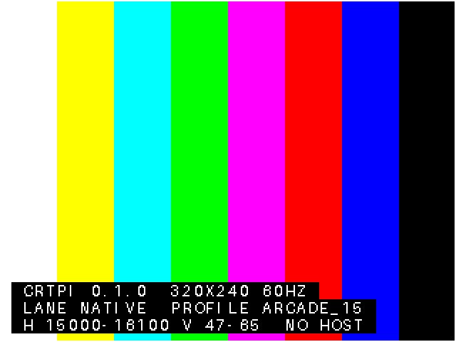

# CRTPi — 15kHz USB display appliance (Raspberry Pi 4)

A headless Buildroot Linux that turns a Pi 4 into a USB video card for
fixed-frequency CRTs (15kHz arcade/SCART monitors — "fixed" describes the
monitor's narrow sync band, not this device: mode timing here is fully
dynamic, synthesized at runtime to land inside that band). Two lanes over
one composite USB gadget:

- **Lane 1 (native, ships first):** vendor bulk protocol; the host's own
  switchres sends *verbatim modelines* (exact fractional refreshes,
  GroovyMAME-grade). Works on Windows (WinUSB) and Linux (libusb).
- **Lane 2 (GUD, v2):** enumerates as a Generic USB Display on Linux;
  the device runs libswitchres at boot to generate a curated, profile-driven
  mode list. Mode-on-demand planned on top.

Both lanes converge on one device-side contract: *receive a fully specified
mode, program vc4 DPI via KMS, report what the PLL actually achieved.*

## Repository map

    VERSION                            single source of truth for releases
    docs/CODE_REVIEW_switchres_VC4.md  review of the Pi3-era VC4 branch
    docs/PROTOCOL.md                   Lane 1 wire protocol v2 ("CRT1")
    daemon/protocol.h                  wire structs (shared with host lib)
    daemon/drm_apply.[ch]              KMS modeline applier + clock readback
    daemon/crt_apply.c                 bring-up harness / regression tool
    daemon/crtd.c                      device daemon (FunctionFS Lane 1)
    daemon/crtpi.conf.example          appliance configuration
    scripts/gadget-setup.sh            configfs composite gadget bring-up
    host/crt1_test.py                  Lane 1 smoke-test client (pyusb)
    host/99-crtpi.rules                udev rule for Linux hosts
    buildroot-external/                BR2_EXTERNAL tree (packages, board)

`crtd` and `crt_apply` compile clean against libdrm on any Linux — you can
dry-run the applier on a desktop with KMS before the Pi image exists
(`crt_apply -c any ...` from a VT, not under X/Wayland).

## Where switchres comes from

switchres is NOT vendored in this repository — there is no cloned copy in
the tree. `buildroot-external/package/switchres/switchres.mk` is a recipe:
at build time Buildroot clones https://github.com/alphanu1/switchres.git
into its download cache (`dl/switchres/`), extracts to
`output/build/switchres-<version>/`, cross-compiles `libswitchres.so`, and
installs it into the target rootfs. By contrast `crtd` uses
`SITE_METHOD = local` pointing at the in-tree `daemon/` sources — our code
ships in the repo; external dependencies are fetched and pinned. That
asymmetry is the conventional Buildroot line.

Three workflows to know:

1. **The pin is a commit hash — and must stay one.** Newer Buildroot
   rejects branch names for git downloads outright, so
   `SWITCHRES_VERSION` in `switchres.mk` is a full 40-char commit hash.
   To pick up new switchres work, look up the new hash
   (`git ls-remote https://github.com/alphanu1/switchres.git master`)
   and bump it deliberately, after reviewing what changed.
2. **Hacking on switchres itself — override, don't re-fetch.** Put
   `SWITCHRES_OVERRIDE_SRCDIR = /path/to/your/switchres` in a `local.mk`
   next to your Buildroot `.config`; Buildroot then rsyncs your live
   checkout into the build. Edit, `make switchres-rebuild`, repeat. The
   pinned git fetch remains the clean/CI path.
3. **Optional: vendor as a git submodule** and point `SWITCHRES_SITE` at
   it with `SITE_METHOD = local` — one offline-buildable tree, revision
   frozen by construction, at the cost of submodule ergonomics.

## Versioning and releases

The `VERSION` file at the repo root is the single source of truth. It is
compiled into crtd (startup banner and the `CMD_GET_INFO` reply report
`crtpi <version>`), so a host can always ask a device what it's running.

Releases are automated: `.github/workflows/release.yml` triggers when
`VERSION` changes on the default branch, builds the SD image on a GitHub
runner, and publishes a release tagged `v<VERSION>` with
`rpi-video-card-v<VERSION>.img` (+ sha256) attached. So cutting a
release is exactly:

    echo 0.2.0 > VERSION
    git commit -am "Release 0.2.0" && git push

The workflow is idempotent (an existing tag short-circuits it), caches
Buildroot downloads between runs, and can also be fired manually from
the Actions tab (workflow_dispatch). Expect ~1.5-3h per release build on
a standard runner.

## Host side: drivers and software

**No bespoke kernel driver is needed on either OS — by design.**

| | Linux host | Windows host |
|---|---|---|
| **Lane 1 (native)** | userspace via libusb; install `host/99-crtpi.rules` for unprivileged access | userspace via WinUSB; auto-bound once crtd ships MS OS 2.0 descriptors (M2) — until then, one-time Zadig assignment |
| **Lane 2 (gud)** | driver already in mainline (`drivers/gpu/drm/gud`, since 5.13) — plug in, it's a display, nothing to install | not available (no Windows GUD driver); use Lane 1 |

What ships per milestone:
- `host/crt1_test.py` (now): pyusb smoke-test — sets a modeline, prints
  the achieved-timing reply, pushes a color-bar frame. The M2 bring-up
  tool.
- `libcrt1` (M2): small C library over libusb/WinUSB — open device, send
  modelines and frames, subscribe to vsync. What applications link.
- `custom_video_crtpi` switchres backend (M5): the real integration —
  makes the device a first-class switchres display so GroovyMAME /
  RetroArch drive it like a CRT-connected GPU, no app changes.

The only bespoke pieces anywhere are the MS OS 2.0 descriptors in crtd
(so Windows auto-selects WinUSB without an INF or signing) and the udev
rule on Linux. Everything else rides stock OS plumbing.

## Configuration

The appliance is configured by `/etc/crtpi.conf` (shipped from
`daemon/crtpi.conf.example`; on the appliance it is symlinked onto the
FAT boot partition so it can be edited by plugging the SD card into any
PC). Every setting here is the *boot default* — all of them can also be
changed at runtime over the Lane 1 control channel, so a host application
never needs the user to touch the file.

    lane = native | gud

Which lane owns the display at power-on. **Default: `native`** — both in
the shipped config and as crtd's built-in fallback if the file is
missing. (`gud` is also not yet functional until M4; setting it today
logs and does nothing.) `native` is Lane 1 (vendor bulk protocol, host
sends verbatim modelines); `gud` is Lane 2 (enumerate as a Generic USB
Display with a generated mode list). Runtime override: `CMD_SET_LANE`
(M3).

    monitor_profile = arcade_15 | arcade_15_25_31 | ntsc | pal
                    | crt_range:<hfmin>-<hfmax>,<vfmin>-<vfmax>

One setting, three jobs — this is the heart of the config:

1. **Lane 2 list seed.** At boot, libswitchres expands the profile into
   the curated mode table the GUD lane advertises (height classes x
   refresh set, clamped to what the profile says the monitor can sync).
2. **Lane 1 guardrail.** Every incoming host modeline is validated
   against the profile's hfreq/vfreq window before it reaches the PLL
   (see `profile_enforce` below).
3. **On-demand synthesizer input.** When a host requests a mode that
   isn't in the list (M4), the profile is what the device synthesizes
   against — same engine, same constraints.

Presets map to the classic switchres monitor definitions; `crt_range:`
takes an explicit horizontal band in Hz and vertical band in Hz for
anything exotic (tri-sync chassis, PVMs with wide bands, etc.).
Runtime override: `CMD_SET_PROFILE` — in Lane 2 this also regenerates
the mode list and re-enumerates (M4).

    splash = on | off

The powered-on idle pattern: 320x240 SMPTE color bars with a 1px white
geometry border and a live status readout — version, active lane,
monitor profile, clamp band, and host state — shown at boot and
whenever the USB host disconnects. A CRT proves the device+DAC chain
works and displays its configuration with no PC involved; the border
doubles as a centering reference. This is exactly what the device
draws (rendered from the same color tables as the code):

The pattern is timed at 60Hz,
falling back to 50Hz for PAL-band profiles; both candidates are checked
against the profile clamp first, so the splash can never emit sync your
profile forbids. `off` leaves the display untouched until a host speaks.

    profile_enforce = on | off

The safety clamp on Lane 1. `on` (default) rejects modelines whose
hfreq/vfreq fall outside the profile window, replying `ST_ERANGE` so the
host knows exactly why. Fixed-frequency deflection hardware can be
physically damaged by out-of-range sync, so this stays on unless you
know precisely why you're turning it off (e.g. a chassis you've measured
beyond its nominal band). Runtime override: `CMD_SET_ENFORCE`.

    gud_heights   = 224,240,256,288,448i,480i,576i
    gud_refreshes = 50,55,57,60
    gud_superres  = on

Lane 2 mode-table shaping: which height classes to emit, which refresh
targets to try per height (each validated against the profile — a
refresh that can't be reached inside the sync band is silently dropped,
not forced), and whether to add 2560-wide super-resolution variants so
the host GPU does horizontal scaling (invisible on a CRT, cheap on the
host). Ignored in native lane.

    /boot/crtpi-extra-modes.txt

Optional file of fully specified extra modes, one switchres modeline per
line, appended to Lane 2's generated list — the escape hatch for the one
weird mode a specific game or chassis wants that generation won't emit.

Precedence at runtime: control-channel commands > config file defaults.
`CMD_SET_PROFILE` persists across reboots (M3); the others revert to the
file at next boot unless persisted by the host.

## Milestones

M1 — **Timing proof (the critical path).** Build `crt_apply` on a Pi 4
     running any KMS-enabled OS. Apply a battery of switchres-computed 15kHz
     modelines to the DPI output; record requested-vs-achieved pixel clock
     (debugfs readback) and measured vfreq (vblank timing). This retires the
     one open technical risk: vc4 PLL quantization at 4-9MHz dot clocks.
     Suggested battery:
       crt_apply -b 6400000 320 328 359 407 240 244 247 262     # 60.02
       crt_apply -b 7156800 384 396 432 456 224 232 235 261     # ~55.0
       crt_apply -b 6293750 256 264 288 320 240 244 247 262     # tight 256w
       crt_apply -b 4992000 256 262 285 317 224 229 232 252 i   # low clock
M2 — **Lane 1 end-to-end.** Buildroot image boots, gadget enumerates, a
     Python host script sends SET_MODE + frames, pixels land on glass.
     Dedicated vblank thread for EVT_VSYNC. Host C library (libusb/WinUSB).
M3 — **Switchres on device.** Package libswitchres (BR2 package included),
     replace the stub profile clamp in crtd with real crt_range validation,
     persist profiles, CMD_SET_LANE actually hands off the display.
M4 — **Lane 2.** GUD gadget function (notro's out-of-tree f_gud_drm, or a
     userspace GUD-over-FunctionFS implementation — decision after M2 based
     on kernel-maintenance appetite), boot-time mode list generation,
     hotplug re-enumeration, mode-on-demand command.
M5 — **Polish.** Read-only rootfs A/B, <5s boot, interlace kernel patches
     vendored, RetroArch/GroovyMAME host integration.

## Building the image (M2)

### Host prerequisites (Linux PC — the build cross-compiles for the Pi)

Debian / Ubuntu:

    sudo apt install build-essential gcc g++ make git unzip rsync bc wget \
        cpio file libssl-dev libncurses-dev python3 perl bzip2 xz-utils

Fedora / RHEL-family equivalent:

    sudo dnf install gcc gcc-c++ make git unzip rsync bc wget cpio file \
        openssl-devel ncurses-devel python3 perl bzip2 xz which

Arch / Manjaro:

    sudo pacman -S --needed base-devel git unzip rsync bc wget cpio \
        openssl ncurses python perl

Notes:
- Disk: ~15-20 GB free. RAM: 4 GB+ recommended. No root needed for the
  build itself. First build compiles a full cross-toolchain (30-90 min);
  later builds are incremental.
- `rsync` is required by Buildroot for local-source packages (crtd) and
  the rootfs overlay — its absence only surfaces mid-build, so install it
  up front. `libncurses-dev` is only needed for `make menuconfig`;
  `libssl-dev` is needed by the kernel build.
- WSL2 works; keep the tree on the Linux filesystem (not /mnt/c).
- For `make daemon` (native build of crtd/crt_apply for M1 bench work),
  the only extra host package is `libdrm-dev` (Fedora: `libdrm-devel`,
  Arch: `libdrm`).

### Build

One command; everything else is fetched automatically:

    git clone <this repo> crtpi && cd crtpi
    make

The top-level Makefile clones Buildroot (pinned to 2025.08.1), applies
`buildroot-external/configs/crtpi4_defconfig`, and builds the SD image to
`buildroot/output/images/rpi-video-card.img` (assembled by our own genimage recipe in `board/crtpi4/`). During that build, Buildroot itself
fetches the kernel, the Pi firmware, and switchres (see "Where switchres
comes from") — no separate clone steps. `make menuconfig` tweaks the
config; `make daemon` builds crtd/crt_apply natively for M1 bench work.
First build takes a while (it compiles a cross-toolchain); subsequent
builds are incremental.

The defconfig targets Buildroot 2025.08.x and pins the rpi
kernel tarball; when M1 fixes the kernel we standardize on, bump both in
one commit — the DPI overlay names and vc4 behavior are kernel-sensitive,
so pin after measuring, not before.

### Containerized build — recommended on rolling distros

On rolling-release hosts (Arch, Fedora rawhide, Tumbleweed) build inside
a container instead of natively:

    make image-docker

This wraps the exact same build in a Debian 12 container
(`scripts/build-container/Dockerfile`), freezing the host gcc/glibc at
versions Buildroot is tested against. Rolling distros ship toolchains
newer than Buildroot's bundled host packages can compile against (gnulib
vs GCC 15 / C23 glibc — see Troubleshooting), and the failures arrive in
generations; the container ends that permanently. On stable distros
(Debian, Ubuntu LTS, Fedora release) the native `make` is fine.

One-time container runtime setup:

    # Arch:            sudo pacman -S docker        (or: podman)
    # Debian/Ubuntu:   sudo apt install docker.io   (or: podman)
    # Fedora:          sudo dnf install podman      (preinstalled on most)

    # docker only -- start the daemon and allow non-root use
    # (Arch does NOT auto-start services after install):
    sudo systemctl enable --now docker
    sudo usermod -aG docker $USER   # takes effect at next login;
    newgrp docker                   # ...or apply to the current shell

podman needs no daemon or group setup. The Makefile auto-detects podman
first, docker otherwise. Notes:

- Output lands in `buildroot/output/` exactly as with the native build.
- Don't mix native and container builds in one tree — `make clean-all`
  when switching (host-compiled artifacts don't interchange).
- Plain docker may leave root-owned files in the tree; reclaim with
  `sudo chown -R $USER: .` (podman rootless doesn't have this issue).
- The docker "legacy builder is deprecated" warning is harmless;
  install `docker-buildx` to silence it.

## Testing without a CRT

No monitor is needed to validate the device — the DPI output has no
hotplug/EDID, so modes commit and scanout runs whether or not glass is
attached, and every meaningful result is reported numerically:

1. **Over USB (primary loop).** Plug into a Linux PC, confirm
   `lsusb` shows `1209:0001`, install `host/99-crtpi.rules`, then:

       ./host/crt1_test.py 6400000 320 328 359 407 240 244 247 262

   `status=0` = clamp passed + KMS committed; `achieved pclk` = the
   clock vc4 actually programmed (debugfs readback — the M1 number);
   `vfreq` = measured from real vblank timing. Values near
   6.4 MHz / 15.72 kHz / 60.018 Hz mean the device works; a CRT would
   only be displaying what these numbers already prove.
2. **On the Pi.** `ssh root@<pi-ip>` (password `crtpi` — bring-up
   image only) and run the `crt_apply` battery from the Milestones
   section for the same measurements with more detail.
3. **On the wires.** A scope or logic analyzer on the DAC's HSYNC GPIO
   should show ~15.7 kHz — ground truth independent of all software.

A CRT becomes necessary only for geometry, centering, and the simple
joy of seeing it work.

## Troubleshooting the build

First response on rolling-release hosts: switch to the containerized
build (see "Containerized build" above) — it eliminates the whole
host-toolchain class of failures below. Known signatures, if you'd
rather patch than containerize:

- **host-m4 fails with a wall of `_GL_ATTRIBUTE_NODISCARD` errors**
  (m4 1.4.19, host GCC >= 15): GCC's C23 default breaks old gnulib. Our
  Buildroot pin (2025.08.1) already contains the upstream fix; this only
  bites older trees.
- **host-m4 fails with `expected identifier or '(' before '_Generic'`**
  in `./string.h` / `./stdlib.h` / `./wchar.h` (m4 1.4.20, very new
  glibc): the host glibc's C23 `_Generic`-based declarations collide with
  gnulib's header wrappers — glibc has out-run even the fixed m4. Force
  the pre-C23 standard for that one package and rebuild it:

      echo 'HOST_M4_CONF_ENV += CFLAGS="$(HOST_CFLAGS) -std=gnu17"' >> buildroot/package/m4/m4.mk
      rm -rf buildroot/output/build/host-m4-*
      make

  If another host package later fails with similar gnulib noise (gmp is
  the usual suspect), apply the same pattern to its `.mk`
  (`HOST_GMP_CONF_ENV += ...`).
- **`Incorrect selection of kernel headers: expected 2.6.x, got 6.1.x`**
  (often alongside an unexpected `-uclibc` toolchain path): the defconfig
  in use predates the headers-series fix. With a custom kernel tarball,
  Buildroot can't infer the headers series; unset, it defaults to "2.6",
  which also silently disqualifies glibc (needs headers >= 3.2) and drops
  the toolchain to uclibc. Current defconfig declares
  `BR2_KERNEL_HEADERS_AS_KERNEL=y` +
  `BR2_PACKAGE_HOST_LINUX_HEADERS_CUSTOM_6_1=y`; after updating it, a
  libc change requires a from-scratch build: `make clean-all`, then
  rebuild. Keep the headers series in lockstep with the kernel pin.
- **switchres download fails: `Commit 'master' does not exist in this
  repository`, then 404s from sources.buildroot.net** — the tree has an
  old `switchres.mk` using a branch name; newer Buildroot only accepts
  commit hashes/tags for git downloads. Update to the current
  `switchres.mk` (hash-pinned) and re-run; no clean needed.
- **`post-image.sh: Permission denied` at the final image step** — the
  execute bit was lost copying the file (editors and GUI copies drop
  permissions; zip/git preserve them):
  `chmod +x buildroot-external/board/crtpi4/post-image.sh` and re-run —
  everything before the image-assembly step is already done.
- **docker: `failed to connect to the docker API at
  unix:///var/run/docker.sock`** — the daemon isn't running; see the
  container runtime setup steps under "Containerized build" above
  (Arch doesn't auto-start services after install).
- **Arch: pacman `bc: /usr/bin/bc exists in filesystem`** — a
  source-installed bc/dc is shadowing the package (common on machines
  that have built MAME-era toolchains). `pacman -Qo /usr/bin/bc`; if
  unowned, `sudo rm /usr/bin/bc /usr/bin/dc` and rerun the install. If
  another package owns it, drop `bc` from the list — any bc in PATH
  satisfies Buildroot.

## Hardware

DPI GPIO0-21 through a vga666-style resistor DAC (RGB666). Same sync rules
as ever: csync via the DPI sync line or an external XNOR, 470R into SCART.
The Pi 4's USB-C port is the device port; power the board through the GPIO
header or a powered splitter since USB-C is occupied by data.

## Safety

`profile_enforce = on` clamps every incoming modeline against the monitor
profile's hfreq/vfreq window before it reaches the PLL. Fixed-frequency
deflection circuits can be damaged by out-of-range sync; the clamp is the
device-side seatbelt and stays on by default.
